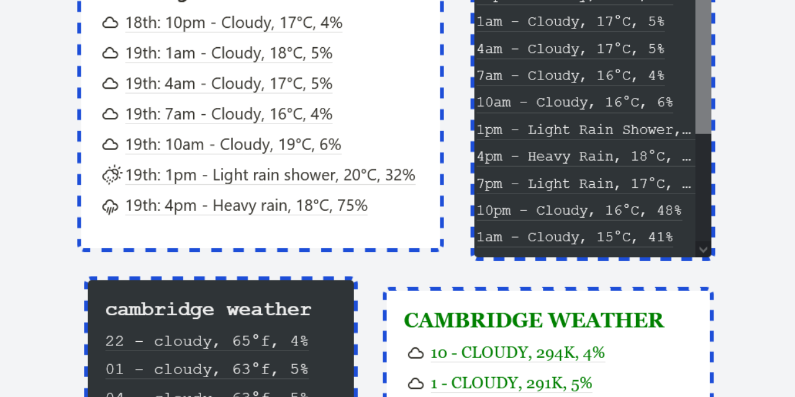

# BlockWidgets

> Simple widgets to mimic Notion's text blocks



## Widgets

- Progress bars
- Met Office three hour forecast
- Buttery bot

## Customisable features

- Theme customisation (system/light/dark)
- Style customisation (default/serif/mono)
- Text size customisation (normal/small)
- Optional padding
- Optional text wrapping
- Capitalisation customisation (normal/lower case/upper case/title case)
- Dark theme customisation (new style/old style)
- CSS customisation

## Website

https://widgets.jonathanjameswatson.com/

## Development

### Setup

```bash
# clone repository and enter it
$ git clone https://github.com/jonathanjameswatson/jjw-widgets.git
$ cd jjw-widgets

# install dependencies
$ yarn install

# serve with hot reload at localhost:3000
$ yarn dev

# generate project
$ yarn build

# serve the .output/ directory for testing
$ yarn start
```

### Proxies

In order to deal with CORS and privacy, this project uses makes use of proxies for accessing APIs. The `NUXT_PUBLIC_PROXY_URL` environment variable can be set to a base URL for all relative API requests. This environment variable can also be set in a `.env` file. When building for Cloudflare workers, a module will set this base URL at build time as Cloudflare workers does not support `process.env`.

See [jonathanjameswatson/jjw-proxy](https://github.com/jonathanjameswatson/jjw-proxy) for an example of a proxy that can be set up to complement this project.

### How to create a new widget

1. If you want your widget to be customisable beyond the default configuration, create a new interface that extends `Configuration` (found in [configuration.ts](./ts/configurations/configuration.ts)). Run the `initialiseConfiguration<T extends Configuration>(configurationName: string, parameters: { [parameterKey in Exclude<keyof T, 'configurationName'>]: Parameter})` to allow this configuration to be controlled on the front page.
2. Create a new component for your widget. You should base this component on existing components in [widgets](./components/widgets). Use `useConfiguration<T extends Configuration>()` from [useConfiguration.ts](./composables/useConfiguration.ts) to import the configuration you need, setting `T` to the configuration class from the previous step (or omit `<T>` if you didn't create one).
3. Add your desired URL for the widget to the `WIDGET_URLS` array in [widgets.ts](./ts/widgets.ts). This array must not have any duplicate values.
4. Add an entry to the `widgets` object in [widgets.ts](./ts/widgets.ts) with its key being the widget URL from the previous step. Import the configuration from step one if you made one. The value of the entry should be an object with `name` as the widget's display name, `componentName` as the name of the widget component from step three and `configuration` as the name of the widget's configuration from step one (or `configuration` if you didn't create one).

### How to create a new type of parameter

1. Consider the type of the value that this parameter will store. Let this be `T`.
2. Create or find a component to control the parameter. This component must have a `modelValue` prop that can take values of type `T` and a `disabled` prop that takes a `boolean`. This component must also emit an `update:modelValue` event with any value.
3. Create a new file exporting an interface that extends `Parameter<T>` from [parameter.ts](./ts/parameters/parameter.ts). Set `type` to be a unique string not used by any other parameters (found in [parameters](./ts/parameters)). Add any custom properties relevant to your new parameter not found in `Parameter<T>`.
4. Add and export a function to this file that returns a function that creates an object that implements this new interface. The arguments of this function should be a display name (`name: string`), arguments that will be used to set the parameter's custom properties from step three and an argument that determines whether the parameter is disabled (`disabled: boolean`). This function should return the output of the `parameter<T, U extends Parameter<T>>(...)` function from [parameter.ts](./ts/parameters/parameter.ts). `U` should be the interface from step three. Call `parameter` with `name`, `type` (from step three), `predicate` (a function returns true if its argument is a valid value of the parameter), `serialise` (a function that converts a type `T` argument to a string), `deserialise` (a function that converts a string argument to type `T`), `defaultValue` (a value that the parameter defaults to), `componentName` (the name of the component from step two), `convertInput` (a function that converts an argument given by `component`'s `input` event to type `T`), `props` (an object with any additional props that should be set on `component`), `extras` (an object with the parameter's custom properties from step three) and `disabled`.

### License

[MIT license](https://choosealicense.com/licenses/mit/)
